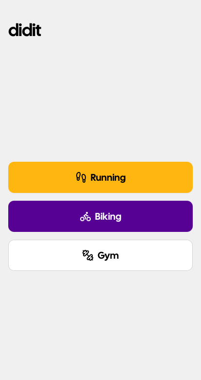

# didit

A personal, **local-only** sport (run, bike and gym) tracker for Android. Zero account, cloud, or analytics.



<br>

## Putting it on your phone

1. On the phone: Settings → About phone → tap _Build number_ 7× to unlock Developer Options → enable _USB debugging_.
2. Plug it in, accept the RSA prompt.
3. `just install` — builds the APK and `adb install`s it.
4. First launch: grant location ("Allow all the time" when prompted on the second screen) and notification permissions.

To iterate with live UI reload:

```bash
just android-dev
```
